# Flappy Crix for Gorilla Tag

> 🤖 **This mod was made with AI.** The code, tools and documentation in this repository were written
> with Claude (an AI model by Anthropic), directed and tested by CRIX. Please report anything that
> doesn't work in [Issues](../../issues).

Play **Flappy Crix** ([crixgamingvr.com/flappycrix](https://crixgamingvr.com/flappycrix)) on a screen inside
Gorilla Tag, with an arcade control deck in front of it. It's the website's game — same physics, coins, store,
cosmetics, daily rewards, seasonal themes and awards — built into the mod with its own VR-friendly layout. Link
your crixgamingvr.com account to share your progress with the website, and play multiplayer with people on the
website.

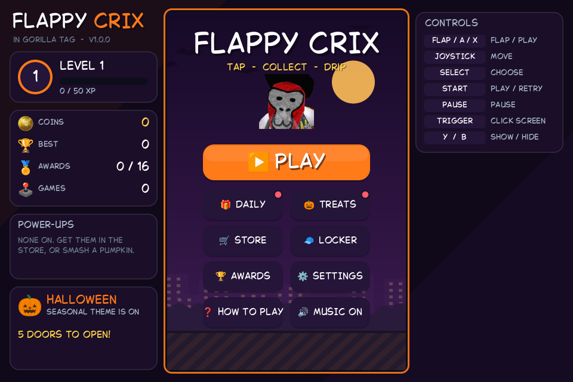

## Features

- **The website's game, built in.** The bird, pipes, gaps, gravity, coins, scoring and power-ups follow the
  website's code tick for tick (60 updates a second), drawn with the site's own pictures, font and sounds.
- **Everything the site has offline**, in the mod's own layout: Store (2X Coins, Shield, Magnet, hats and
  trails), Locker, Daily reward streak, 16 awards, account levels, Settings, How to play, pause and game over.
  Your progress is saved on your PC (`%LOCALAPPDATA%\FlappyCrix\save.txt`).
- **Seasonal themes, on the site's dates** (Sydney time, like the site):
  - **Halloween** (October): purple sky, moon, bats, pumpkins to smash for prizes, cobwebs, the witch flying
    over, Halloween music, and the **Trick or Treat** calendar (31 doors; Witch Hat, Skeleton Mask, Ghost Trail,
    Pumpkin Head).
  - **Christmas** (1–26 December): snow, Santa's sleigh, Christmas music, the **Advent** calendar
    (Reindeer Ears, Tinsel Trail, Santa's Hat).
  - **Easter** (Palm Sunday – Easter Monday): eggs and the **Egg Hunt** (Bunny Ears, Pastel Trail).
  - **Birthday** (March, from 2027): confetti, and the Golden Party Hat on 18 March.
  - Settings can pick a season or turn them off.
- **Arcade cabinet**: joystick to move through the menus, **FLAP**, **SELECT** (menus only — it never flaps),
  **START**, **PAUSE**, **− / +** to resize. Press the buttons with your fingertip. The laser pointer clicks too.
- **Portable**: opens in front of you when you load in. **B** hides it, **Y** brings it back.
- **Silent when hidden**: the music and sounds stop while the screen is hidden and come back when you open it.
- **Doesn't slow the game down**: the in-game version runs and draws on its own thread.
- **Your crixgamingvr.com account.** Press **LINK ACCOUNT**: the game shows a code and a QR code. On your phone
  or PC open **crixgamingvr.com/link**, sign in there (Google, or email and password) and enter the code — or
  just scan the QR code. The game is then signed in to the same account (the site's own console-linking
  feature) and stays signed in. Your coins, best score, games played, cosmetics, awards and level are saved to
  the account and shared with the website both ways. The first time, the progress you made as a guest goes
  to the account. Daily rewards and calendar doors stay per PC, as on the website.
- **Multiplayer with website players**, on the website's own Photon servers and rooms: **PLAY ONLINE** shows
  the open rooms, **CREATE ROOM** (Free Play, Race, Last One Standing, Coin Rush; everyone or code-only), and
  **JOIN BY CODE** with an on-screen keyboard. Everyone gets the same pipes and coins from the host's seed;
  other birds fly next to yours with their names, hats and trails; scores, a room menu (PAUSE) and the
  results. Chat from website players shows (through the site's own filter). Ranked rooms and the seasonal
  room modes stay on the website; voice chat isn't possible in the mod and nothing is typed.
- Nothing opens in your desktop browser unless you press **OPEN ON THIS PC** on the account screen.
- Local-only, no colliders (nothing can be climbed), no dependency on Gorilla Tag's internal code.
- **Website mode** (optional, `UseWebsite = true`): streams the real crixgamingvr.com/flappycrix from a hidden
  browser instead (see [How it works](#website-mode)).

| | |
|---|---|
| 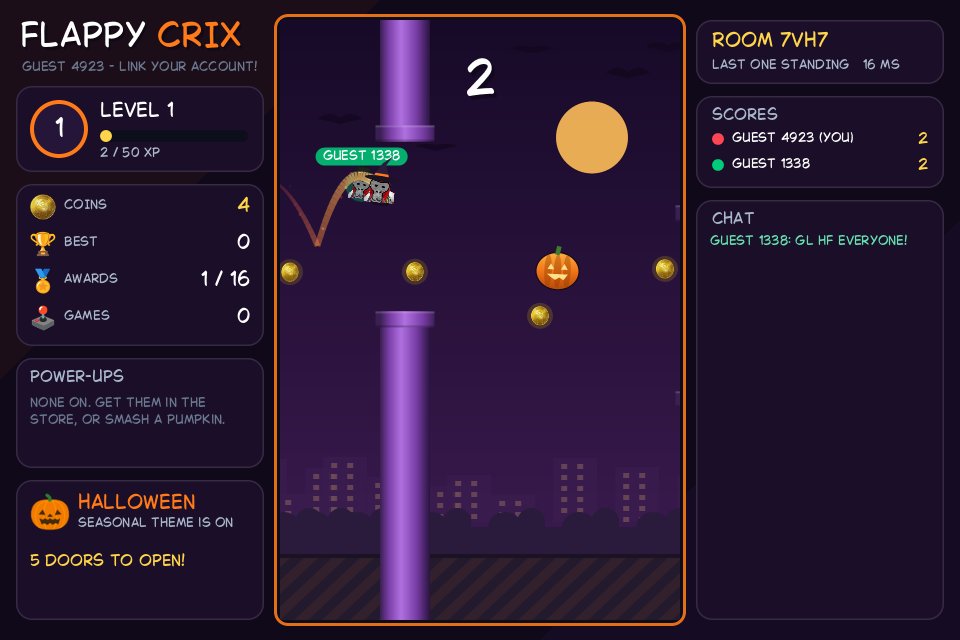 | 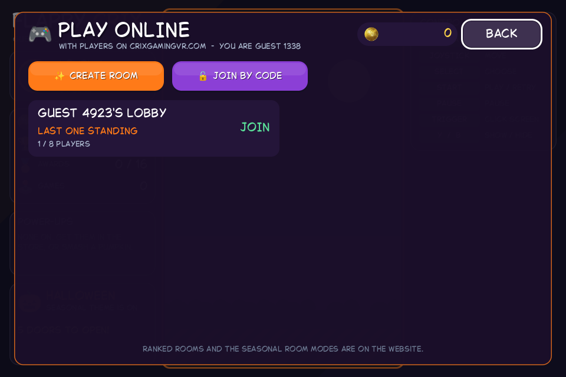 |
| 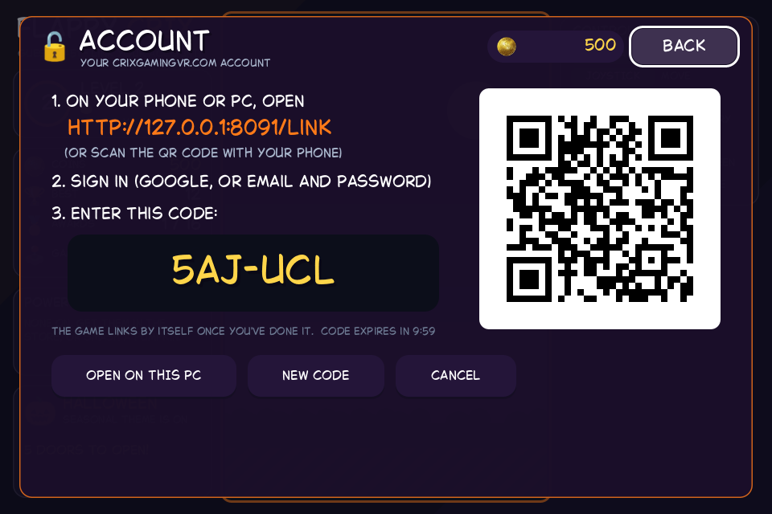 | 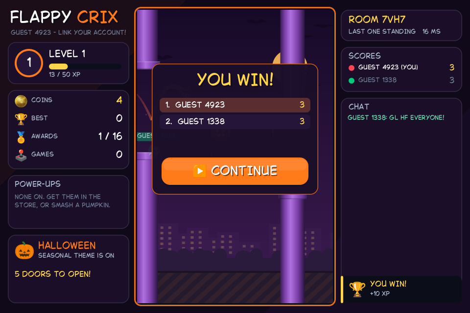 |
| 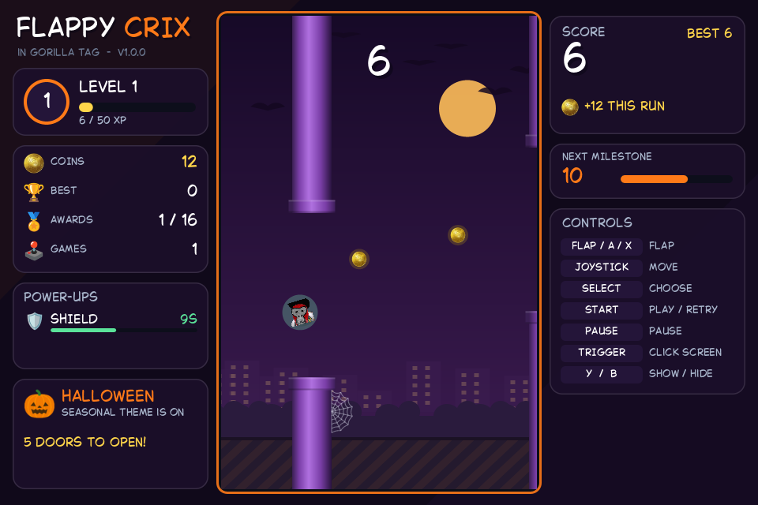 | 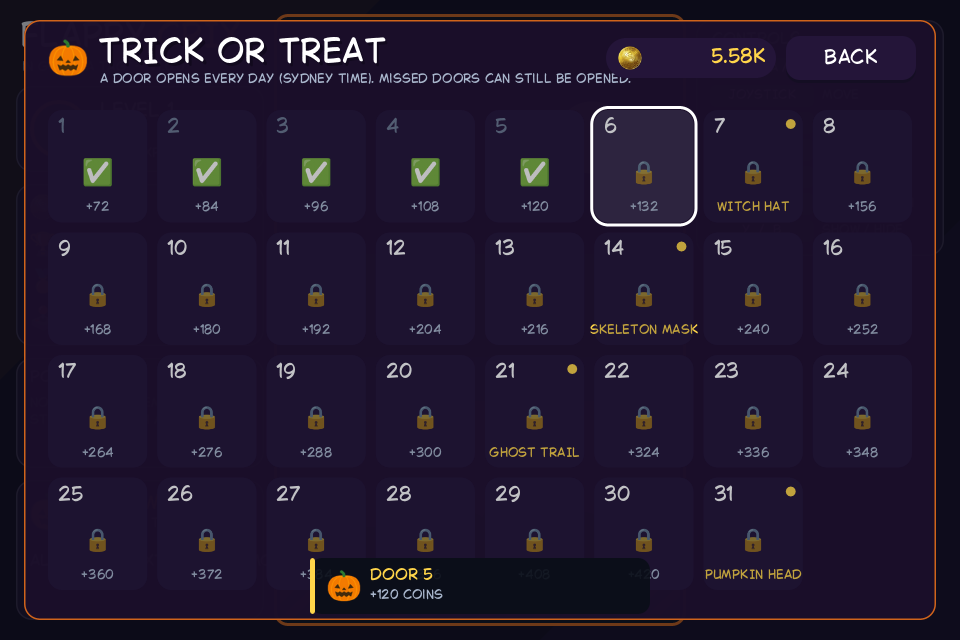 |
| 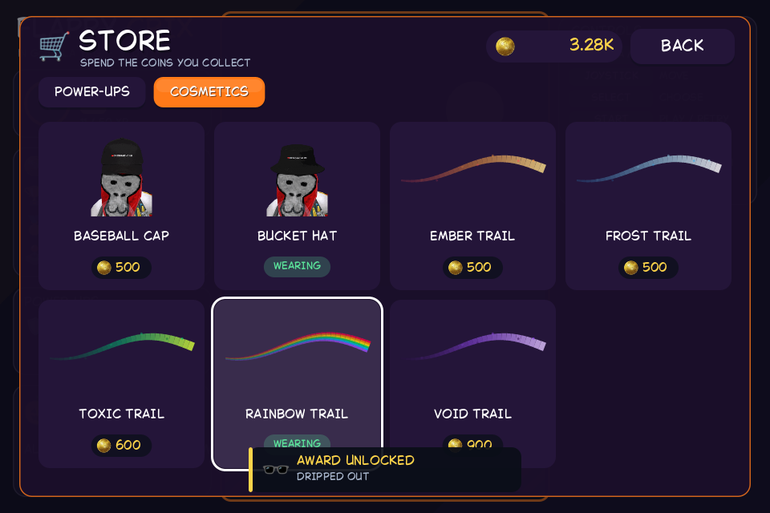 | 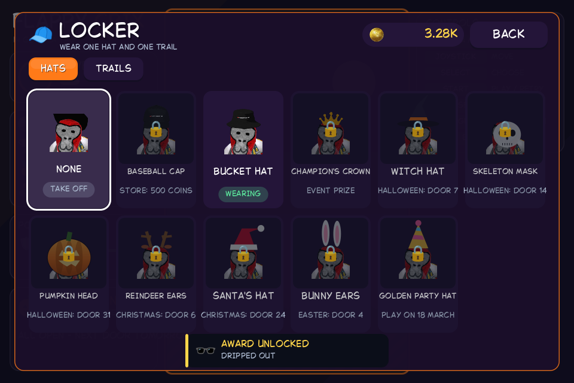 |
| 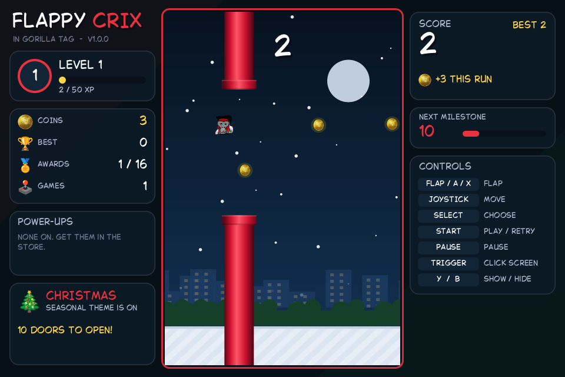 | 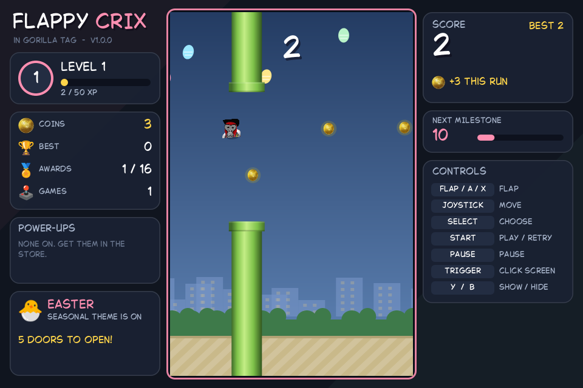 |

(Pictures from `tools/native-harness` and `tools/online-harness`, which run the in-game version's code outside
the game; the account picture shows a test server's address instead of crixgamingvr.com/link.)

## Install

1. Install [BepInEx 5](https://github.com/BepInEx/BepInEx/releases) (x64) into Gorilla Tag and run the game once.
2. Download `FlappyCrix-vX.Y.Z.zip` from [Releases](../../releases) and unzip **the whole `FlappyCrix` folder**
   into `Gorilla Tag/BepInEx/plugins/`, so you have `BepInEx/plugins/FlappyCrix/FlappyCrix.dll` **and**
   `BepInEx/plugins/FlappyCrix/Web/`. (The in-game version - pictures, sounds and music - is all inside the DLL,
   so the DLL alone is enough for it; the `Web` folder is only for the optional website mode.)
3. Start Gorilla Tag. The screen appears in front of you once you've loaded in.

Settings live in `BepInEx/config/com.crix.flappycrix.cfg` (created on first run).

## Controls

| | VR | Keyboard |
|---|---|---|
| Open in front of you | **Y** | F9 |
| Hide (pauses a run, goes quiet) | **B** | F8 |
| Flap (on the main menu: play) | Deck **FLAP**, or **X** / **A** | Space |
| Move the menu highlight | Deck **joystick** (hold grip on the red knob, push) | Arrow keys |
| Press the highlighted button | Deck **SELECT** (menus only, never flaps) | Enter |
| Play / retry / resume | Deck **START** | F5 |
| Pause / resume | Deck **PAUSE** | P |
| Back (close a menu) | — | Backspace |
| Screen smaller / bigger | Deck **−** / **+** | − / = |
| Click a button, or flap by clicking the game | Laser + trigger | Mouse |

Press deck buttons with your **index fingertip**, like Gorilla Tag's own buttons. A button's ring lights up
while your fingertip is over it, and you feel a buzz when it presses. (The mod uses the game's own fingertip
points; if a game update moves them, it works the fingertip out from your controller instead.)

## How it works

```
Gorilla Tag ─ BepInEx ─ FlappyCrix.dll
                          ├─ the in-game version (its own thread): the site's rules, menus and seasons,
                          │  drawn into one 960×640 picture ──► texture on the in-game screen
                          ├─ sounds: the site's mp3 files (Web/img), played from the screen
                          ├─ account: crixgamingvr.com/api/device-link ─► Firebase Auth ─► Firestore users/{uid}
                          │           (+ PlayFab statistics and bans), like the website
                          ├─ multiplayer: Photon (the website's app, version and region), JSON over secure
                          │           WebSockets like the website's Photon SDK; the site's rooms and events
                          └─ input: deck, X/A, laser, keyboard ──► the game
```

- **Same rules as the website.** `NativeSim` is a tick-for-tick port of the site's game loop (gravity,
  flap, terminal speed, the elliptical hitbox, the gap that narrows with your score, the pipe beat chosen one
  pipe ahead, coin lanes, magnet, shield bounce, Halloween pumpkins and cobwebs). The one deliberate
  difference: the site forgets to save your best after a pipe crash; here every crash counts.
- **Seasons use the site's calendar** in Sydney time, with the site's colours, sky decorations, fly-bys,
  music and calendar prizes (`Season.cs`).
- **The layout is the mod's own**: your level, coins, power-ups and season on the left, the game in the middle,
  score, controls and messages on the right; the store and other menus fill the screen.
- **Online, the same way the website does it.** Linking uses the site's device-link API (made for consoles);
  the save is the site's `users/{uid}` document in its format (only the game's own fields are written, so the
  site's other fields are untouched); multiplayer uses the site's Photon app, room names (`crix_XXXX`), room
  properties, event codes and payloads, and its seeded pipe generator, so website and VR players share rooms.
  The site's public settings are read from `crixgamingvr.com/api.json` when the game starts.
- **Limits that come from the site:** the Photon app is on a plan with a limit of players online at once
  (website and mod together); nothing on the site's servers checks coins or results, so the mod only ever
  applies the website's own rules and never claims staff roles or sends host commands unless it is the host.

### Website mode

With `UseWebsite = true`, the real crixgamingvr.com/flappycrix is streamed instead: a browser already on your
PC that can run hidden (Edge, Chrome, Brave, Vivaldi, Chromium... — or, if there's none, Google's Chrome for
Testing headless shell, downloaded once) loads the page with no window, and the frames are streamed onto the
screen over the DevTools protocol. Input goes into the page as real key and mouse events; only the game page
may load in the panel; it also goes quiet while the screen is hidden. Browser profiles and the downloaded
engine live in `%LOCALAPPDATA%\FlappyCrix`.

## Settings worth knowing (`com.crix.flappycrix.cfg`)

| Setting | Default | |
|---|---|---|
| `UseWebsite` | `false` | `false` = the in-game version. `true` = website mode (streams crixgamingvr.com/flappycrix). |
| `Width` / `Distance` / `HeightOffset` | 0.6 m / 0.75 m / −0.43 m | Screen size, distance, and its **bottom edge** height (just above the deck, like an arcade cabinet). The deck's − / + change `Width`; the screen grows upwards. |
| `InGameFrameRate` | 30 | Pictures per second of the in-game version (drawn on its own thread). |
| `FlapStartsGame` | `true` | FLAP on the main menu starts a run. |
| `OnlineFeatures` | `true` | Account linking and multiplayer. `false` = offline only. The linked account is remembered in `%LOCALAPPDATA%\FlappyCrix\account.txt` (delete it, or press SIGN OUT, to sign out). |
| `UseGameFingertips` / `FingertipOffset` | `true` / (0, −0.02, 0.085) | Deck buttons use Gorilla Tag's fingertip points; the offset (metres from the controller) is the backup. |
| `ShaderOverride` | empty | Advanced: if the screen or deck is invisible, a shader name to use instead (see the log). |
| Website mode only: `UseRemoteWebsite`, `UseOfflineCopy`, `AutoFallbackToNative`, `ResolutionWidth/Height` (1280×800), `BrowserPath`, `DownloadEngine`, `BrowserFrameRate`, `StreamQuality`, `OpenLinksOnDesktop` | | See the descriptions in the settings file. |

Music, sound volumes, the light theme, reduced motion and the seasonal theme are set in the game's own
**Settings** menu (saved with your progress).

## If something's wrong

Send `BepInEx/LogOutput.log`. It says which mode runs (`Mode: In-game version ...`), which shader draws the
screen, the season, and any sound file that couldn't load. In website mode it also says which browsers were
found and why an engine was skipped, and `%LOCALAPPDATA%\FlappyCrix\selftest.txt` has the website self test.

When the mod starts, the screen opens in front of you straight away. If no screen appears at all, open `BepInEx/LogOutput.log` and search for
`Flappy Crix`. No lines means BepInEx didn't load the mod (check the folder is `BepInEx/plugins/FlappyCrix/` with
`FlappyCrix.dll` inside); otherwise the lines after it say what went wrong.

| Log says | What to do |
|---|---|
| `Still waiting for the player's camera` | The game hasn't created the player yet; the screen opens as soon as it does. |
| `No sound files (Web/img isn't next to the DLL)` | Unzip the whole `FlappyCrix` folder, including `Web`, for the music and sounds. |
| `The in-game version stopped: ...` | Please report it with the log. |
| `Couldn't load the live site (...)` | The reason is in brackets, and the screen shows it too. The packaged copy (the site's offline mode) plays meanwhile, and the mod switches back to crixgamingvr.com by itself when it can. |
| `The website says it is offline` while on the live site | The site's own connection check failed; the mod asks it to check again every 6 s. If it never says `online`, something on the PC is blocking crixgamingvr.com for the hidden browser (firewall, antivirus, VPN). |
| `No browser on this PC can run the website hidden` | Normal with only Opera / Opera GX / Firefox: the engine is downloaded once. |
| `Engine download failed: ...` | The PC couldn't reach Google's download servers (firewall/antivirus?). The built-in version runs; it tries again next start. |
| `This browser couldn't run hidden; it won't be tried again` | That browser is skipped from now on (until it's updated); the next one, or the downloaded engine, is used. |
| `DevTools port did not appear` | Something blocked the hidden browser (antivirus, or a work/school policy that disables browser debugging). |
| `Screen stream: ... ms per frame to decode` is high | Lower `BrowserFrameRate` (e.g. 20) or `StreamQuality`. |
| Screen/deck invisible | Note the `Rendering with shader:` line and report it; try `ShaderOverride`. |

## Repository layout

```
src/FlappyCrix/        C# source of the BepInEx plugin
  Web/                 BrowserGame (page rules, bridge, self test), EdgeBrowserGame, UwbBrowserGame,
    Cdp/               DevTools protocol client: launcher, WebSocket, JSON, page controller (no Unity code)
  VR/                  XR input, screen, arcade deck, joystick, laser
  Online/              account linking + cloud save (Account, CloudSave, Firestore), Photon client + the site's
                       multiplayer (PhotonClient, Multiplayer), ChatFilter, QrCode, SiteConfig - no Unity code
  Native/              the in-game version: FlappyApp (menus, store, seasons, online screens...), NativeSim (rules),
                       NativeRenderer + Canvas (drawing), Season, Catalog, SaveData, AppRunner (its thread)
                       - no Unity code - and NativeFlappyGame (the Unity side: texture, sounds)
mod/FlappyCrix/        the plugin folder as shipped (Web/ = packaged website + bridge.js)
tools/                 tests (engine-harness, native-harness, live-harness, load-check, api-audit, Playwright suites),
                       packaging, build scripts
docs/screenshots/      screenshots and mock-ups
.github/workflows/     builds FlappyCrix.dll and the release zip on every push / tag
```

## Building

**With the game installed:**
```powershell
dotnet build src\FlappyCrix -c Release -p:GamePath="C:\Program Files (x86)\Steam\steamapps\common\Gorilla Tag"
```
(The project references the optional UnityWebBrowser DLLs; for a build without them use the Mono route below.)

**Without the game (Linux/macOS/CI, Mono):** compiles against the real BepInEx DLL plus reference
stand-ins for Unity/UnityWebBrowser in `tools/refs/`:
```sh
sudo apt install mono-devel
tools/get_bepinex.sh
tools/refs/build_dll.sh        # -> mod/FlappyCrix/FlappyCrix.dll
tools/load-check/run.sh        # loads it like a normal install and runs the start-up
tools/api-audit/run.sh         # checks every Unity call against Unity's own source
tools/live-harness/run.sh      # the website engine vs a slow / down / stalled stand-in live site
tools/native-harness/run.sh    # the in-game version: rules, menus, seasons, its thread, a picture of every screen
tools/online-harness/run.sh    # account + multiplayer vs stand-ins, and vs the website's own multiplayer code
```
GitHub Actions does this automatically; pushing a version tag (e.g. `v1.0.0`) publishes a release with the zip attached.

## Optional: UnityWebBrowser engine

Instead of the PC's Edge, the mod can use UnityWebBrowser's bundled Chromium (set `Engine = UnityWebBrowser`).
That needs its DLLs and engine folder from a Unity build matching Gorilla Tag's Unity version — see
[DEPENDENCIES.md](DEPENDENCIES.md) and `tools/collect_uwb.ps1`. Most people don't need this.

## Testing

What was verified, how, and what still needs a real headset: [TESTING.md](TESTING.md).

## Credits & licences

- Flappy Crix game, art, sounds and music © CRIX — [CRIX447/crix-website](https://github.com/CRIX447/crix-website).
  The UI font is Bubble Sans (SIL OFL 1.1); emoji are Noto Color Emoji (Apache 2.0).
- Mod source code: MIT licence ([LICENSE](LICENSE)). Website content in `mod/FlappyCrix/Web/` is **not** covered by the MIT licence.
- Made with AI: Claude by Anthropic.
- Third-party components: [THIRD_PARTY_NOTICES.md](THIRD_PARTY_NOTICES.md).

Not affiliated with Another Axiom or Microsoft. Gorilla Tag is a trademark of Another Axiom.
