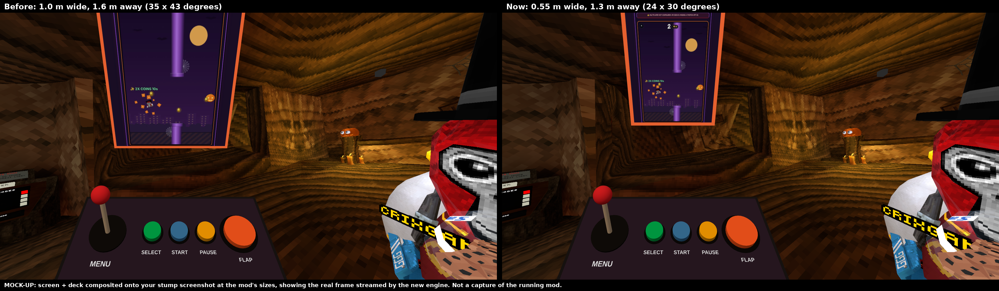

# Flappy Crix for Gorilla Tag

> 🤖 **This mod was made with AI.** The code, tools and documentation in this repository were written
> with Claude (an AI model by Anthropic), directed and tested by CRIX. Please report anything that
> doesn't work in [Issues](../../issues).

Play the real **Flappy Crix** website game ([crixgamingvr.com/flappycrix](https://crixgamingvr.com/flappycrix))
on a screen inside Gorilla Tag, with an arcade control deck in front of it.


<sub>Mock-up: the screen and deck composited onto a stump screenshot at the old and new sizes, showing a real frame from the website engine. Not a capture of the running mod yet.</sub>

## Features

- **The actual website game, nothing extra to install.** The mod uses the Microsoft Edge that comes with
  Windows 10/11 (or Chrome/Brave if you have them) as a **hidden engine**: it runs headless — no window, nothing
  appears on your desktop — and the page is streamed onto the in-game screen. Plays the live page by default
  and falls back to a copy packaged with the mod if it can't load.
- **Arcade control deck**: joystick to move through the menus, **FLAP**, **SELECT**, **START**, **PAUSE**,
  and **− / +** to resize the screen.
- **Portable**: opens in front of you when you load in. **B** hides it, **Y** brings it back in front of you.
- **Sign-in, Discord, YouTube, TikTok, the shop and other site pages open in your PC's normal browser**, never in-game.
- Laser pointer (right hand + trigger) to click anything on the screen.
- **Native fallback**: if no website engine can run, a Unity version of Flappy Crix runs instead.
- Local-only, no colliders (nothing can be climbed), no dependency on Gorilla Tag's internal code.

More pictures in [`docs/screenshots`](docs/screenshots): a real frame from the website engine
(`15-edge-engine-stream-frame.png`), the native fallback (`14-native-fallback.png`), and mock-ups.

## Install

1. Install [BepInEx 5](https://github.com/BepInEx/BepInEx/releases) (x64) into Gorilla Tag and run the game once.
2. Download `FlappyCrix-vX.Y.Z.zip` from [Releases](../../releases) and unzip it into `Gorilla Tag/BepInEx/plugins/`,
   so you have `BepInEx/plugins/FlappyCrix/FlappyCrix.dll`.
3. Start Gorilla Tag. The screen appears in front of you once you've loaded in.

That's it — Microsoft Edge is already on every Windows 10/11 PC. Settings live in
`BepInEx/config/com.crix.flappycrix.cfg` (created on first run).

## Controls

| | VR | Keyboard |
|---|---|---|
| Open in front of you | **Y** | F9 |
| Hide (pauses a run) | **B** | F8 |
| Flap | Deck **FLAP**, or **X** / **A** | Space |
| Move the menu highlight | Deck **joystick** (hold grip on the red knob, push) | Arrow keys |
| Press the highlighted item | Deck **SELECT** (flaps while playing) | Enter |
| Start / retry / resume | Deck **START** | F5 |
| Pause / resume | Deck **PAUSE** | P |
| Screen smaller / bigger | Deck **−** / **+** | − / = |
| Click on the screen | Laser + trigger | Mouse |

Press deck buttons by putting your hand down on them (you'll feel a buzz).

## How it works

```
Gorilla Tag ─ BepInEx ─ FlappyCrix.dll
                          ├─ hidden Edge/Chrome (headless, own profile in BrowserData/)
                          │     ├─ loads crixgamingvr.com/flappycrix (or the packaged copy)
                          │     ├─ bridge.js injected before the site's scripts
                          │     └─ frames ──DevTools protocol──► texture on the in-game screen
                          ├─ input: real key/mouse events into the page (deck, X/A, laser, keyboard)
                          └─ anything that isn't the game ──► your desktop browser
```

- **Input reaches the website's own code.** A flap while playing is a real Space key press, which the site's
  own keydown handler turns into `jump()`. Laser clicks are real mouse clicks. The joystick drives the site's
  own controller navigation (`padMove` / `padActivate`). Nothing in the game's logic is rewritten.
- **Only the game page may load in the panel.** Every page load is checked before it happens; anything else
  (sign-in, Discord login, other site pages) is cancelled and opened in your desktop browser instead.
- **Browser dialogs** (`confirm()`, e.g. "Remove friend?") can't be answered in VR, so they answer "no" and
  show the site's own message; `alert()` becomes a site toast.
- **The hidden browser closes with the game**, even if the game crashes (it is tied to Gorilla Tag's process).
- **Save data** (coins, cosmetics, best score as a guest) lives in `BepInEx/plugins/FlappyCrix/BrowserData/EdgeProfile`.
  Signing in happens in your desktop browser, not in the panel.

## Settings worth knowing (`com.crix.flappycrix.cfg`)

| Setting | Default | |
|---|---|---|
| `Width` / `Distance` / `HeightOffset` | 0.55 m / 1.3 m / −0.1 m | Screen size and placement (about 24° × 30° of your view). The deck's − / + change `Width`. |
| `UseRemoteWebsite` | `true` | Live page; `false` = packaged copy (offline). |
| `Engine` | `Auto` | `Auto` = hidden Edge/Chrome → UnityWebBrowser (if installed) → native version. |
| `BrowserPath` | empty | Use a specific Chromium browser instead of finding Edge/Chrome automatically. |
| `BrowserFrameRate` / `StreamQuality` | 30 / 80 | Screen updates per second and picture quality. Lower these if Gorilla Tag's frame rate drops. |
| `OpenLinksOnDesktop` | `true` | Sign-in/socials/other pages open in your desktop browser. |
| `ShaderOverride` | empty | Advanced: if the screen or deck is invisible, a shader name to use instead (see the log). |

Settings files from the first test build are reset to the new screen size once.

## If something's wrong

Send `BepInEx/LogOutput.log` and `BepInEx/plugins/FlappyCrix/BrowserData/selftest.txt`. The log says which
engine was used (`Mode: Website (...) via hidden msedge ...`), which shader draws the screen, the stream's frame
rate and decode time, and why an engine was skipped. The self test checks JavaScript, CSS, images, audio, the
canvas, frames reaching the screen, key input reaching the page, and the page's frame rate.

| Log says | What to do |
|---|---|
| `No Microsoft Edge or Chrome found` | Install Edge or Chrome, or set `BrowserPath`. The native version runs meanwhile. |
| `DevTools port did not appear` | Something blocked the hidden browser (antivirus, or a work/school policy that disables browser debugging). |
| `Screen stream: ... ms per frame to decode` is high | Lower `BrowserFrameRate` (e.g. 20) or `StreamQuality`. |
| Screen/deck invisible | Note the `Rendering with shader:` line and report it; try `ShaderOverride`. |

## Repository layout

```
src/FlappyCrix/        C# source of the BepInEx plugin
  Web/                 BrowserGame (page rules, bridge, self test), EdgeBrowserGame, UwbBrowserGame,
    Cdp/               DevTools protocol client: launcher, WebSocket, JSON, page controller (no Unity code)
  VR/                  XR input, screen, arcade deck, joystick, laser
  Native/              native fallback: rules + renderer (no Unity code) + Unity glue
mod/FlappyCrix/        the plugin folder as shipped (Web/ = packaged website + bridge.js)
tools/                 tests (engine-harness, native-harness, Playwright suites), packaging, build scripts
docs/screenshots/      screenshots and mock-ups
.github/workflows/     builds FlappyCrix.dll and the release zip on every push / tag
```

## Building

**With the game installed:**
```powershell
dotnet build src\FlappyCrix -c Release -p:GamePath="C:\Program Files (x86)\Steam\steamapps\common\Gorilla Tag"
```
(The project references the optional UnityWebBrowser DLLs; for a build without them use the Mono route below.)

**Without the game (Linux/macOS/CI, Mono):** compiles against the real BepInEx DLL plus reference
stand-ins for Unity/UnityWebBrowser in `tools/refs/`:
```sh
sudo apt install mono-devel
tools/get_bepinex.sh
tools/refs/build_dll.sh        # -> mod/FlappyCrix/FlappyCrix.dll
```
GitHub Actions does this automatically; pushing a version tag (e.g. `v1.0.0`) publishes a release with the zip attached.

## Optional: UnityWebBrowser engine

Instead of the PC's Edge, the mod can use UnityWebBrowser's bundled Chromium (set `Engine = UnityWebBrowser`).
That needs its DLLs and engine folder from a Unity build matching Gorilla Tag's Unity version — see
[DEPENDENCIES.md](DEPENDENCIES.md) and `tools/collect_uwb.ps1`. Most people don't need this.

## Testing

What was verified, how, and what still needs a real headset: [TESTING.md](TESTING.md).

## Credits & licences

- Flappy Crix game, art, sounds and font © CRIX — [CRIX447/crix-website](https://github.com/CRIX447/crix-website).
- Mod source code: MIT licence ([LICENSE](LICENSE)). Website content in `mod/FlappyCrix/Web/` is **not** covered by the MIT licence.
- Made with AI: Claude by Anthropic.
- Third-party components: [THIRD_PARTY_NOTICES.md](THIRD_PARTY_NOTICES.md).

Not affiliated with Another Axiom or Microsoft. Gorilla Tag is a trademark of Another Axiom.
