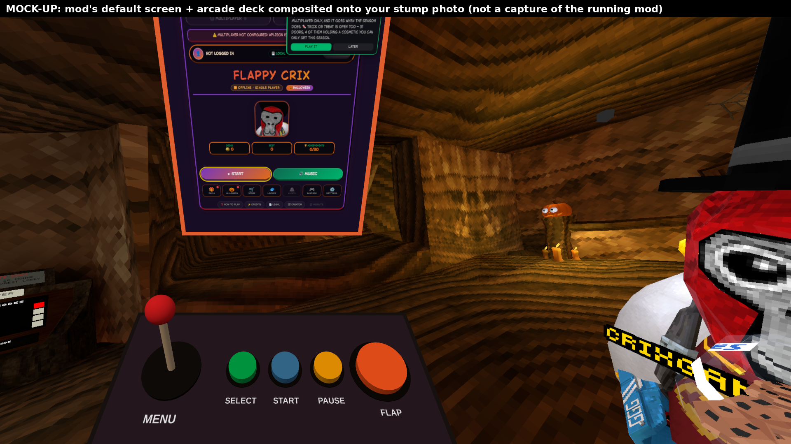

# Flappy Crix for Gorilla Tag

> 🤖 **This mod was made with AI.** The code, tools and documentation in this repository were written
> with Claude (an AI model by Anthropic), directed and tested by CRIX. Please report anything that
> doesn't work in [Issues](../../issues).

Play the real **Flappy Crix** website game ([crixgamingvr.com/flappycrix](https://crixgamingvr.com/flappycrix))
on a screen inside Gorilla Tag, with an arcade control deck in front of it.


<sub>Mock-up: the mod's screen and deck composited onto a stump screenshot. Not a capture of the running mod yet.</sub>

## Features

- **The actual website game**, running in an embedded Chromium browser (UnityWebBrowser / CEF) — not a remake.
  Plays the live page by default and falls back to a copy packaged with the mod if it can't load.
- **Arcade control deck**: joystick to move through the menus, plus **FLAP**, **SELECT**, **START** and **PAUSE** buttons you press with your hand.
- **Portable**: opens in front of you when you load in. **B** hides it, **Y** brings it back in front of you.
- **Sign-in, Discord, YouTube, TikTok, the shop and other site pages open on your PC's browser**, never in-game.
- Laser pointer (right hand + trigger) to click anything on the screen.
- **Native fallback**: if the browser engine isn't installed or fails its self-test, a Unity version of Flappy Crix runs instead.
- Local-only, no colliders (nothing can be climbed), no dependency on Gorilla Tag's internal code.

## Controls

| | VR | Keyboard |
|---|---|---|
| Open in front of you | **Y** | F9 |
| Hide (pauses a run) | **B** | F8 |
| Flap | Deck **FLAP**, or **X** / **A** | Space |
| Move the menu highlight | Deck **joystick** (hold grip on the knob, push) | Arrow keys |
| Press the highlighted item | Deck **SELECT** (flaps while playing) | Enter |
| Start / retry / resume | Deck **START** | F5 |
| Pause / resume | Deck **PAUSE** | P |
| Click on the screen | Laser + trigger | Mouse |

## Install (players)

1. Install [BepInEx 5](https://github.com/BepInEx/BepInEx/releases) (x64) into Gorilla Tag and run the game once.
2. Download `FlappyCrix-vX.Y.Z.zip` from [Releases](../../releases) and unzip it into `Gorilla Tag/BepInEx/plugins/`
   so you have `BepInEx/plugins/FlappyCrix/FlappyCrix.dll`.
3. For the website version you also need the browser engine (the `UWB` folder + its DLLs) — see
   [Installing the browser engine](#installing-the-browser-engine). Without it, the native version runs.

Settings: `BepInEx/config/com.crix.flappycrix.cfg` (created on first run).

## Repository layout

```
src/FlappyCrix/        C# source of the BepInEx plugin
  Web/                 browser host, local web server, input bridge (C#), self test
  VR/                  XR input, screen panel, arcade deck, joystick, laser
  Native/              native Unity fallback game
mod/FlappyCrix/        the plugin folder as shipped (Web/ = packaged website + bridge.js)
tools/                 packaging, tests, build scripts, reference assemblies
docs/screenshots/      screenshots and mock-ups
.github/workflows/     builds FlappyCrix.dll and the release zip on every push / tag
```

## Building

**With the game installed (recommended):**
```powershell
dotnet build src\FlappyCrix -c Release -p:GamePath="C:\Program Files (x86)\Steam\steamapps\common\Gorilla Tag"
```

**Without the game (Linux/macOS/CI, Mono):** compiles against the real BepInEx DLL plus reference
stand-ins for Unity/UnityWebBrowser in `tools/refs/`:
```sh
sudo apt install mono-devel
tools/get_bepinex.sh
tools/refs/build_dll.sh        # -> mod/FlappyCrix/FlappyCrix.dll
```
GitHub Actions does this automatically (`.github/workflows/build.yml`); pushing a tag like `v1.1.0`
publishes a release with the zip attached.

## Installing the browser engine

UnityWebBrowser ships as Unity packages, so its DLLs come from a tiny Unity build made with
**Gorilla Tag's exact Unity version**:

1. Check the version: right-click `Gorilla Tag\UnityPlayer.dll` → Properties → Details.
2. Make an empty Unity project with that version; add the VoltUPR registry
   (<https://upr.voltstro.dev/-/web/about>, scopes `dev.voltstro`, `org.nuget`, `com.cysharp.unitask`).
   ⚠️ Not from npmjs.com — that package name is a squatted placeholder.
3. Install **Unity Web Browser** + **Unity Web Browser CEF Engine (Win x64)**; Player Settings: Mono, stripping Disabled; build Windows x64.
4. `.\tools\collect_uwb.ps1 -UnityBuild <build folder> -GamePath <Gorilla Tag folder> -UnityProject <project>`
5. Copy `mod\FlappyCrix\` into `BepInEx\plugins\`.

Details, licensing and limitations: [DEPENDENCIES.md](DEPENDENCIES.md).

## Testing

`tools/test_web.py` (26 checks), `tools/test_deck.py` (8), `tools/test_links.py` (13) and
`tools/test_live_injection.py` run the website + bridge in headless Chromium. Results and what still
needs testing inside the game are in [TESTING.md](TESTING.md). On every launch the mod also runs an
in-game self-test and writes `BepInEx/plugins/FlappyCrix/BrowserData/selftest.txt`.

## Credits & licences

- Flappy Crix game, art, sounds and font © CRIX — [CRIX447/crix-website](https://github.com/CRIX447/crix-website).
- Mod source code: MIT licence ([LICENSE](LICENSE)). Website content in `mod/FlappyCrix/Web/` is **not** covered by the MIT licence.
- Made with AI: Claude by Anthropic.
- Third-party components: [THIRD_PARTY_NOTICES.md](THIRD_PARTY_NOTICES.md).

Not affiliated with Another Axiom. Gorilla Tag is a trademark of Another Axiom.
